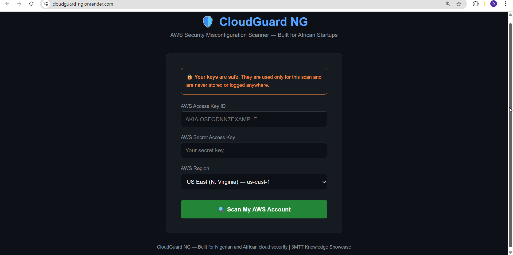
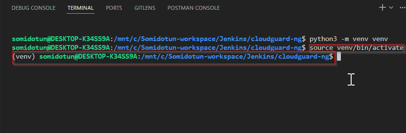
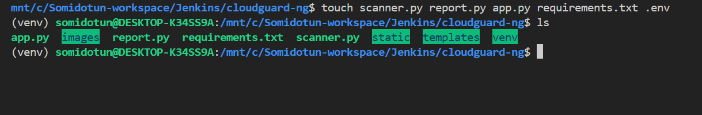
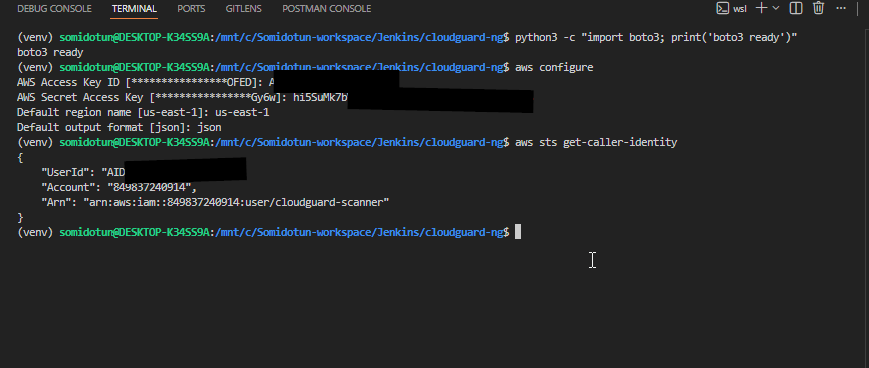
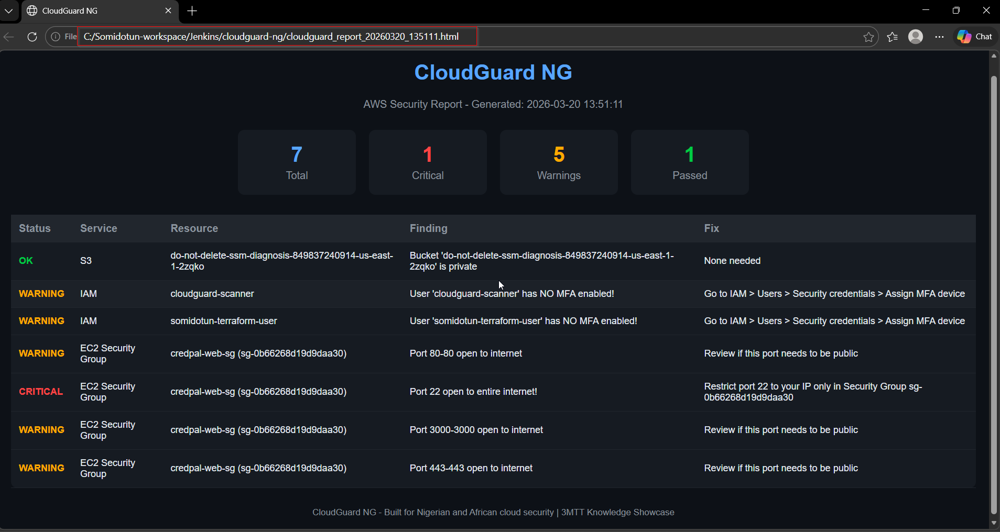
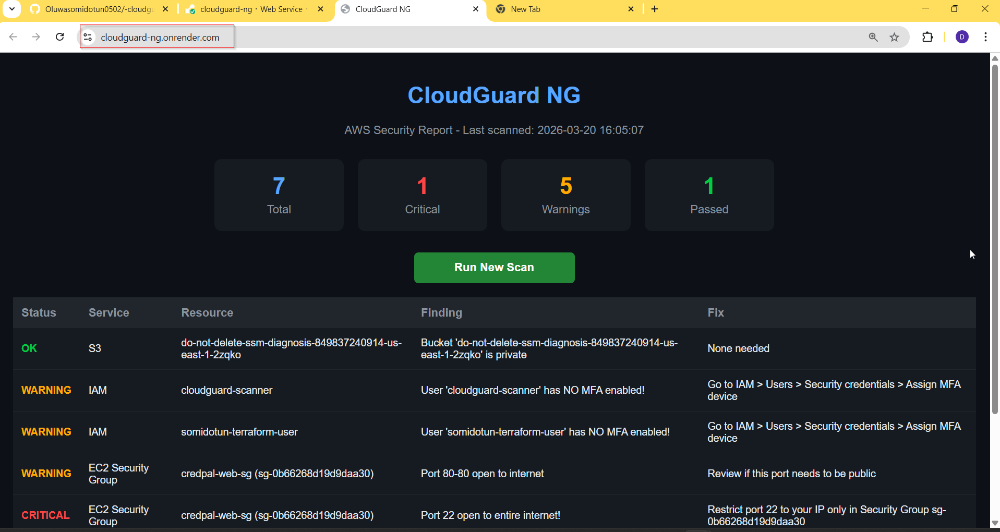

# CloudGuard NG
### AWS Security Misconfiguration Scanner — Built for African Startups



> **Live Demo:** [https://cloudguard-ng.onrender.com](https://cloudguard-ng.onrender.com)
> *(First load may take 30-60 seconds on free tier — then it runs fast)*

---

## The Problem

Nigerian and African startups are rapidly moving to AWS — but many are unknowingly running **dangerously misconfigured cloud infrastructure.**

Common issues include:
* S3 buckets accidentally made public, exposing sensitive customer data
* IAM users with no MFA, making accounts easy to hijack
* EC2 security groups with SSH ports open to the entire internet

These misconfigurations cause **real data breaches** that cost businesses millions. Hiring a cloud security engineer to audit your account costs thousands of dollars — money most African startups do not have.

---

## The Solution

**CloudGuard NG** is a free, automated AWS security scanner that audits your cloud account in seconds and tells you exactly what is misconfigured — and how to fix it.

Anyone can visit the live URL, enter their own AWS credentials, and instantly get a professional security report. No installation required.

---

## Live Demo

**[https://cloudguard-ng.onrender.com](https://cloudguard-ng.onrender.com)**

---

## Screenshots

### Step 1 — Setting Up the Environment


### Step 2 — Project Structure


### Step 3 — AWS CLI Installation


### Step 4 — Connecting AWS Account


### Step 5 — First Security Report (HTML)


### Step 6 — Live on Render


### Step 7 — Final Product (Multi-user Form)


---

## Features

* **S3 Bucket Scanner** — detects publicly accessible buckets
* **IAM User Auditor** — flags users with no MFA enabled
* **Security Group Checker** — finds ports dangerously open to the internet
* **Live Dashboard** — color-coded findings (Critical / Warning / Passed)
* **Fix Recommendations** — plain English instructions for every finding
* **Multi-user** — anyone can scan their own AWS account safely
* **Keys never stored** — credentials used only for the scan session

---

## Tech Stack

| Tool | Purpose |
|---|---|
| Python 3 | Core programming language |
| Boto3 | AWS SDK — talks to AWS services |
| Flask | Web framework for the dashboard |
| Gunicorn | Production web server |
| Render | Free cloud hosting |
| AWS IAM | Security scanning permissions |

---

## Run Locally

### Prerequisites
* Python 3.12+
* AWS account with an IAM user

### Steps
```bash
# 1. Clone the repo
git clone https://github.com/Oluwasomidotun0502/-cloudguard-ng.git
cd cloudguard-ng

# 2. Create and activate virtual environment
python3 -m venv venv
source venv/bin/activate

# 3. Install dependencies
pip install -r requirements.txt

# 4. Run the app
python3 app.py
```

Open **http://127.0.0.1:5000** in your browser.

---

## IAM Permissions Required

To scan your AWS account, your IAM user needs these policies:
* SecurityAudit
* AmazonS3ReadOnlyAccess
* IAMReadOnlyAccess

---

## Built By

**Oluwasomidotun Adepitan** — Cloud & DevOps Engineer
* GitHub: [@Oluwasomidotun0502](https://github.com/Oluwasomidotun0502)
* LinkedIn: [oluwasomidotun-adepitan](https://www.linkedin.com/in/oluwasomidotun-adepitan)
* Email: anuoluwapodotun@gmail.com

---

## About This Project

Built as part of the **3MTT (3 Million Technical Talent) Knowledge Showcase** — a Nigerian government initiative to develop tech talent across Africa.

CloudGuard NG was created to solve a real problem faced by Nigerian and African startups: **affordable, accessible cloud security auditing.**

---

*CloudGuard NG — Built for Nigerian and African cloud security | 3MTT Knowledge Showcase*
